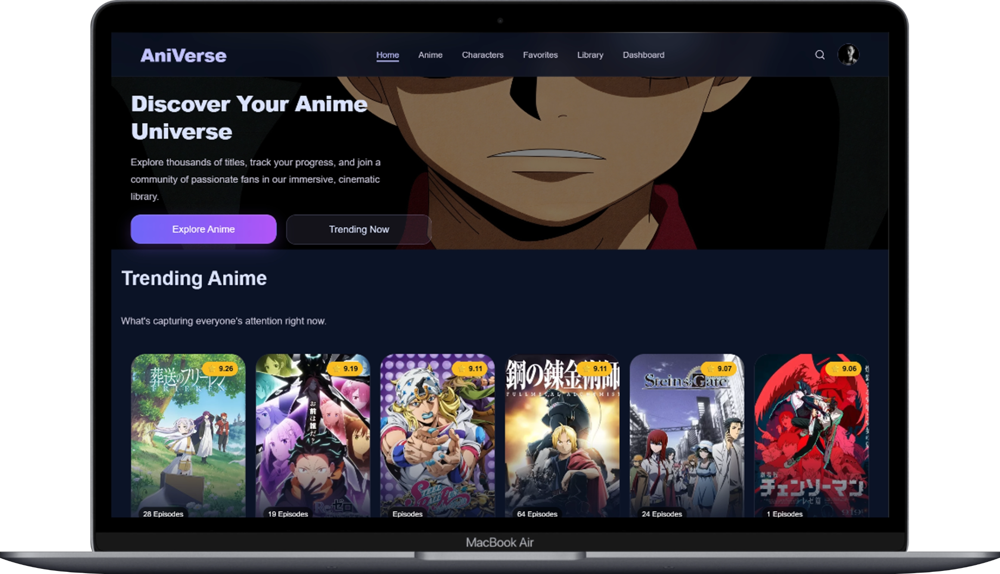
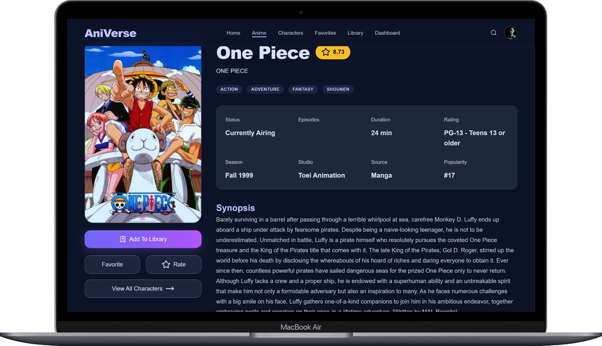
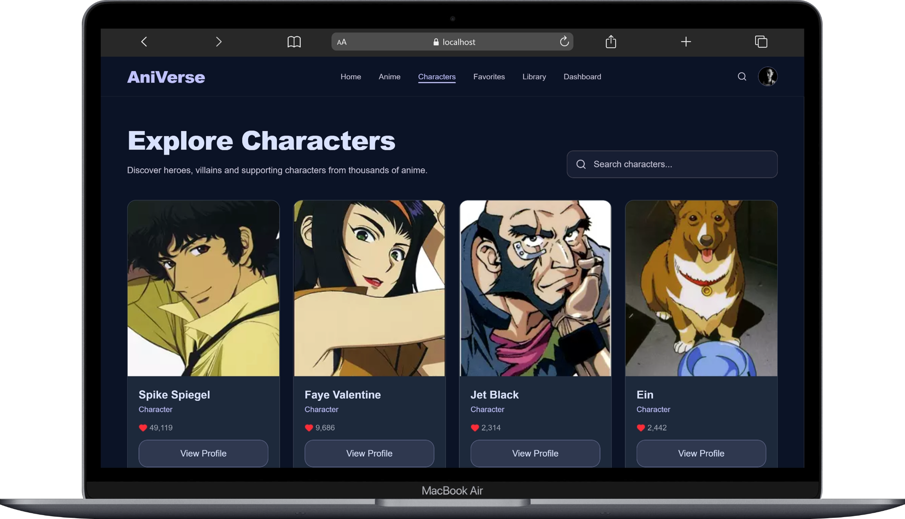
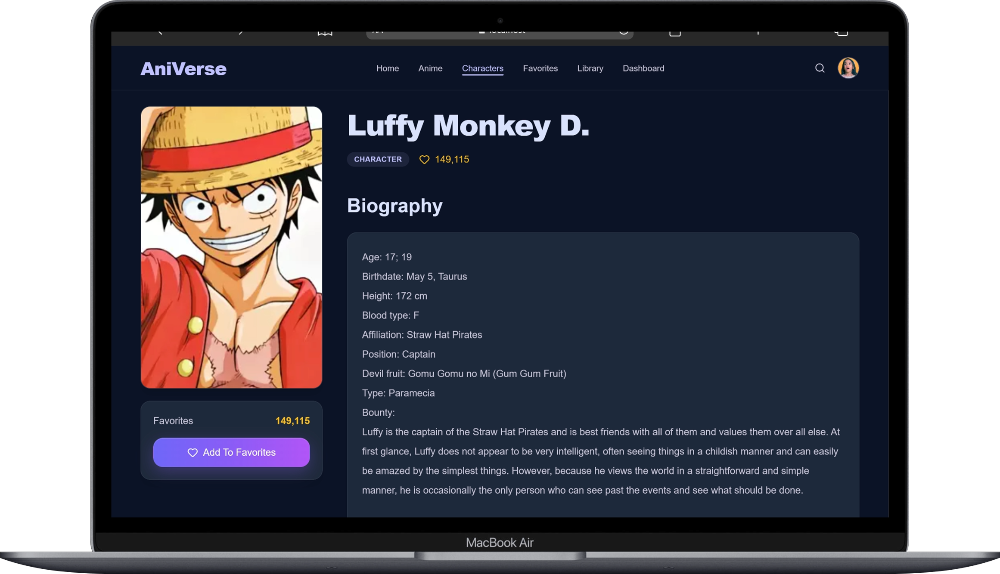
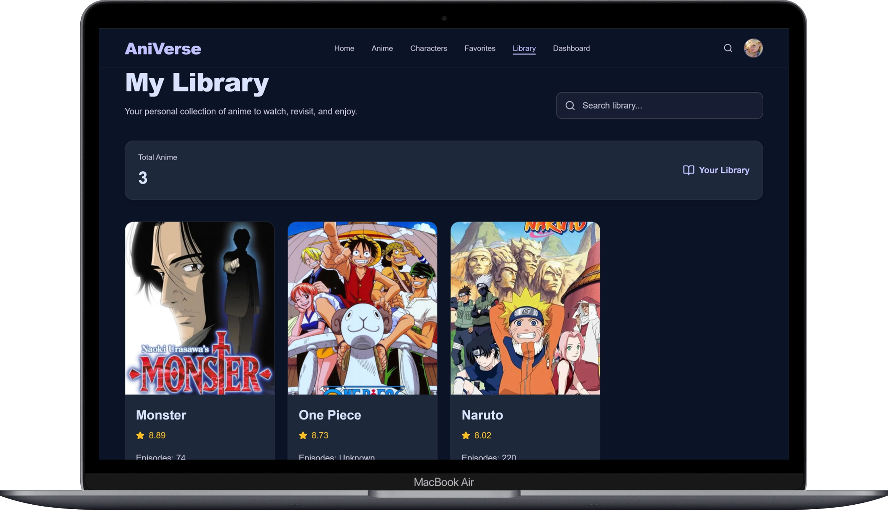

<div align="center">

# 📖 AniVerse

### Discover, track, and fall in love with anime all over again.

**AniVerse** is a sleek, modern Anime Discovery Web Application built with **React.js**, powered by the **Jikan API (MyAnimeList)**. Browse thousands of anime and characters, dive into rich details, and build your own personal **Favorites** list and **Library** — all wrapped in a beautiful dark UI with glassmorphism aesthetics.


</div>

---

## ✨ Features

- 🔥 **Browse Top Anime** — explore the highest-rated titles on MyAnimeList
- 🌸 **Browse Seasonal Anime** — stay up to date with what's airing right now
- 🔍 **Search Anime** — find any anime instantly by name
- 🎯 **Filter Anime by Genre** — narrow down results to match your taste
- 📄 **View Anime Details** — synopsis, stats, trailers, and more
- 🎭 **View Anime Characters** — see the full cast of any anime
- 👥 **Browse All Characters** — explore a global character database
- 🪪 **View Character Profiles** — detailed bios and info per character
- ❤️ **Add Anime to Favorites** — save the shows you love
- 🗑️ **Remove Anime from Favorites** — manage your list with ease
- 📚 **Add Anime to Library** — track anime you're watching or planning to watch
- ➖ **Remove Anime from Library** — keep your library clean and up to date
- 📱 **Responsive Design** — flawless experience on any screen size
- 🌙 **Beautiful Dark UI** — immersive, eye-friendly dark theme
- 🔔 **Toast Notifications** — instant, elegant feedback on every action
- ⏳ **Loading & Error Handling** — smooth spinners and graceful error states

---

## 🛠 Tech Stack

**Frontend**

| Technology          | Purpose                 |
| ------------------- | ----------------------- |
| ⚛️ React.js         | Core UI library         |
| 🧠 Redux Toolkit    | Global state management |
| 🧭 React Router DOM | Client-side routing     |
| 🌐 Axios            | HTTP requests           |
| 🎨 Tailwind CSS v4  | Utility-first styling   |
| 🖼️ Lucide React     | Icon library            |
| 🔥 React Hot Toast  | Toast notifications     |

**Backend**

| Technology     | Purpose                                  |
| -------------- | ---------------------------------------- |
| 🗄️ JSON Server | Local mock backend (Favorites & Library) |

**API**

| Service                         | Purpose                       |
| ------------------------------- | ----------------------------- |
| 🌍 Jikan REST API (MyAnimeList) | Anime & character data source |

---

## 📂 Folder Structure

```
AniVerse/
├── data/
│   └── db.json                    # Local JSON Server database
├── public/
│   ├── favicon.svg
│   ├── hero_background.jpg
│   └── icons.svg
├── src/
│   ├── api/
│   │   ├── favoritesApi.js
│   │   └── libraryApi.js
│   ├── assets/
│   │   ├── hero.png
│   │   ├── react.svg
│   │   └── vite.svg
│   ├── components/
│   │   ├── ui/
│   │   │   ├── Error.jsx
│   │   │   ├── SearchFilter.jsx
│   │   │   └── Spinner.jsx
│   │   ├── AnimeCard.jsx
│   │   ├── AnimeLists.jsx
│   │   ├── AppLayout.jsx
│   │   ├── CharacterCard.jsx
│   │   ├── CharactersList.jsx
│   │   ├── Footer.jsx
│   │   ├── Hero.jsx
│   │   ├── Navbar.jsx
│   │   ├── SeasonalAnime.jsx
│   │   └── TrendingAnimes.jsx
│   ├── features/
│   │   ├── animes/
│   │   │   └── animeSlice.js
│   │   ├── favorites/
│   │   │   └── favotiteSlice.js
│   │   └── library/
│   │       └── librarySlice.js
│   ├── libs/
│   │   └── axios.js
│   ├── pages/
│   │   ├── AnimeCharactersPage.jsx
│   │   ├── AnimeDetailsPage.jsx
│   │   ├── AnimePage.jsx
│   │   ├── CharacterProfilePage.jsx
│   │   ├── CharactersPage.jsx
│   │   ├── DashboardPage.jsx
│   │   ├── FavoritesPage.jsx
│   │   ├── HomePage.jsx
│   │   ├── LibraryPage.jsx
│   │   └── PageNotFound.jsx
│   ├── store/
│   │   └── store.js
│   ├── App.jsx
│   ├── index.css
│   └── main.jsx
├── .gitignore
├── README.md
├── eslint.config.js
├── index.html
├── package.json
└── vite.config.js
```

---

## 📸 Screenshots

> _Add your own screenshots below to showcase the app._

| Home Page                            | Anime Details                                     |
| ------------------------------------ | ------------------------------------------------- |
|  |  |

| Characters                                  | Character Profile                                         |
| ------------------------------------------- | --------------------------------------------------------- |
|  |  |

| Library | | ------------------------------------ |  |

---

## ⚙ Installation

Clone the repository and install the dependencies:

```bash
git clone <repository-url>
cd aniverse
npm install
```

---

## 🚀 Run the Project

AniVerse requires **two servers** running simultaneously — the frontend (Vite) and the backend (JSON Server).

**1️⃣ Run the Frontend**

```bash
npm run dev
```

**2️⃣ Run the Backend**

```bash
npx json-server db.json
```

| Service                  | URL                     | Port   |
| ------------------------ | ----------------------- | ------ |
| 🖥️ Frontend (Vite)       | `http://localhost:5173` | `5173` |
| 🗄️ Backend (JSON Server) | `http://localhost:3000` | `3000` |

> ⚠️ Make sure both servers are running for Favorites and Library features to work correctly.

---

## 🌐 API

AniVerse is powered by the **Jikan API**, a free and open REST API for MyAnimeList data.

🔗 Base URL: `https://api.jikan.moe/v4`

No API key required — just fetch and explore! 🎉

---

## 🎨 UI Design

AniVerse follows a custom, cohesive design system built for a premium anime browsing experience:

- 🌑 **Dark Theme** — a sleek, immersive dark color palette
- 💜 **Purple Gradient Buttons** — eye-catching, vibrant call-to-actions
- 🧊 **Glassmorphism Cards** — frosted-glass card effects for depth and elegance
- 📐 **Responsive Grid Layout** — adapts beautifully across all devices
- 🔤 **Modern Typography** — clean, readable, and stylish font hierarchy
- ♻️ **Reusable Tailwind Utilities** — consistent, maintainable styling patterns

---

## 📈 Future Improvements

- 🔐 Authentication
- 👤 User Profiles
- ⭐ Anime Rating System
- 📌 Watchlist
- 💬 Reviews & Comments
- 🤖 Recommendation System
- 📄 Pagination
- ♾️ Infinite Scroll
- 🌗 Dark/Light Theme Toggle

---

## 👨‍💻 Author

**Walid Noussir**
_Full Stack JavaScript Developer_

[](https://github.com/walidnoussir)
[](https://www.linkedin.com/in/walidnoussir/)
[](https://walidnoussirportfolio.vercel.app/)

---

## ⭐ Support

If you like **AniVerse**, consider giving it a ⭐ on GitHub — it really helps and motivates further development!

<div align="center">

**Made with ❤️ and lots of ☕ by Walid Nasser**

</div>
